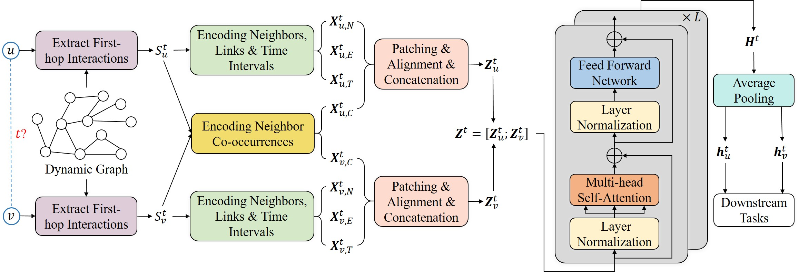

# Towards Better Dynamic Graph Learning: New Architecture and Unified Library
This repository is built for the Paper [Towards Better Dynamic Graph Learning: New Architecture and Unified Library](https://arxiv.org/abs/2303.13047).

🔔 If you have any questions or suggestions, please feel free to let us know. 
You can directly email [Le Yu](https://yule-buaa.github.io/) using the email address yule@buaa.edu.cn or post an issue on this repository.

## 💥 News 💥

- 🔥🔥🔥[2023/09] Our paper is accepted by **NeurIPS 2023 (Poster)**. The camera ready version is coming soon.
- 🔥🔥🔥[2023/09] DyGFormer is evaluated on [TGB Leaderboards](https://tgb.complexdatalab.com) and it currently **ranks first** on tgbl-wiki-v2 and tgbl-coin. 
  It also performs good on other datasets. See our other repository [DyGLib_TGB](https://github.com/yule-BUAA/DyGLib_TGB) for more details.

## Overview

Dynamic Graph Library (DyGLib) is an open-source toolkit with standard training pipelines, extensible coding interfaces, and comprehensive evaluating strategies, 
which aims to promote standard, scalable, and reproducible dynamic graph learning research. Diverse benchmark datasets and thorough baselines are involved in DyGLib.


## Benchmark Datasets and Preprocessing

Fourteen datasets are used in DyGLib, including Wikipedia, Reddit, MOOC, LastFM, Myket, Enron, Social Evo., UCI, Flights, Can. Parl., 
US Legis., UN Trade, UN Vote, and Contact. The first five datasets are bipartite, and the others only contain nodes with a single type.

Most of the used original dynamic graph datasets come from [Towards Better Evaluation for Dynamic Link Prediction](https://openreview.net/forum?id=1GVpwr2Tfdg), 
which can be downloaded [here](https://zenodo.org/record/7213796#.Y1cO6y8r30o). 
Please download them and put them in ```DG_data``` folder. 
The Myket dataset comes from [Effect of Choosing Loss Function when Using T-batching for Representation Learning on Dynamic Networks](https://arxiv.org/abs/2308.06862) and 
can be accessed from [here](https://github.com/erfanloghmani/myket-android-application-market-dataset). 
The original and preprocessed files for Myket dataset are included in this repository.

We can run ```preprocess_data/preprocess_data.py``` for pre-processing the datasets.
For example, to preprocess the *Wikipedia* dataset, we can run the following commands:
```{bash}
cd preprocess_data/
python preprocess_data.py  --dataset_name wikipedia
```
We can also run the following commands to preprocess all the original datasets at once:
```{bash}
cd preprocess_data/
python preprocess_all_data.py
```

## Dynamic Graph Learning Models

Eight popular continuous-time dynamic graph learning methods are included in DyGLib, including 
[JODIE](https://dl.acm.org/doi/10.1145/3292500.3330895), 
[DyRep](https://openreview.net/forum?id=HyePrhR5KX), 
[TGAT](https://openreview.net/forum?id=rJeW1yHYwH), 
[TGN](https://arxiv.org/abs/2006.10637), 
[CAWN](https://openreview.net/forum?id=KYPz4YsCPj), 
[EdgeBank](https://openreview.net/forum?id=1GVpwr2Tfdg), 
[TCL](https://arxiv.org/abs/2105.07944), and 
[GraphMixer](https://openreview.net/forum?id=ayPPc0SyLv1).
Our recent work [DyGFormer](https://arxiv.org/abs/2303.13047) is also integrated into DyGLib, which can explore the correlations of the source node and destination node by a neighbor co-occurrence encoding scheme, and
effectively and efficiently benefit from longer histories via a patching technique.



## Evaluation Tasks

DyGLib supports dynamic link prediction under both transductive and inductive settings with three (i.e., random, historical, and inductive) negative sampling strategies,
as well as dynamic node classification.


## Incorporate New Datasets or New Models

New datasets and new models are welcomed to be incorporated into DyGLib by pull requests.
* For new datasets: The format of new datasets should satisfy the requirements in ```DG_data/DATASETS_README.md```. 
  Users can put the new datasets in ```DG_data``` folder, and then run ```preprocess_data/preprocess_data.py``` to get the processed datasets.
* For new models: Users can put the model implementation in  ```models``` folder, 
  and then create the model in ```train_xxx.py``` or ```evaluate_xxx.py``` to run the model.


## Environments

[PyTorch 1.8.1](https://pytorch.org/), 
[numpy](https://github.com/numpy/numpy),
[pandas](https://github.com/pandas-dev/pandas),
[tqdm](https://github.com/tqdm/tqdm), and 
[tabulate](https://github.com/astanin/python-tabulate)


## Executing Scripts

### Scripts for Dynamic Link Prediction
Dynamic link prediction could be performed on all the thirteen datasets. 
If you want to load the best model configurations determined by the grid search, please set the *load_best_configs* argument to True.
#### Model Training
* Example of training *DyGFormer* on *Wikipedia* dataset:
```{bash}
python train_link_prediction.py --dataset_name wikipedia --model_name DyGFormer --patch_size 2 --max_input_sequence_length 64 --num_runs 5 --gpu 0
```
* If you want to use the best model configurations to train *DyGFormer* on *Wikipedia* dataset, run
```{bash}
python train_link_prediction.py --dataset_name wikipedia --model_name DyGFormer --load_best_configs --num_runs 5 --gpu 0
```
#### Model Evaluation
Three (i.e., random, historical, and inductive) negative sampling strategies can be used for model evaluation.
* Example of evaluating *DyGFormer* with *random* negative sampling strategy on *Wikipedia* dataset:
```{bash}
python evaluate_link_prediction.py --dataset_name wikipedia --model_name DyGFormer --patch_size 2 --max_input_sequence_length 64 --negative_sample_strategy random --num_runs 5 --gpu 0
```
* If you want to use the best model configurations to evaluate *DyGFormer* with *random* negative sampling strategy on *Wikipedia* dataset, run
```{bash}
python evaluate_link_prediction.py --dataset_name wikipedia --model_name DyGFormer --negative_sample_strategy random --load_best_configs --num_runs 5 --gpu 0
```

### Scripts for Dynamic Node Classification
Dynamic node classification could be performed on Wikipedia and Reddit (the only two datasets with dynamic labels).
#### Model Training
* Example of training *DyGFormer* on *Wikipedia* dataset:
```{bash}
python train_node_classification.py --dataset_name wikipedia --model_name DyGFormer --patch_size 2 --max_input_sequence_length 64 --num_runs 5 --gpu 0
```
* If you want to use the best model configurations to train *DyGFormer* on *Wikipedia* dataset, run
```{bash}
python train_node_classification.py --dataset_name wikipedia --model_name DyGFormer --load_best_configs --num_runs 5 --gpu 0
```
#### Model Evaluation
* Example of evaluating *DyGFormer* on *Wikipedia* dataset:
```{bash}
python evaluate_node_classification.py --dataset_name wikipedia --model_name DyGFormer --patch_size 2 --max_input_sequence_length 64 --num_runs 5 --gpu 0
```
* If you want to use the best model configurations to evaluate *DyGFormer* on *Wikipedia* dataset, run
```{bash}
python evaluate_node_classification.py --dataset_name wikipedia --model_name DyGFormer --load_best_configs --num_runs 5 --gpu 0
```


## Acknowledgments

We are grateful to the authors of 
[TGAT](https://github.com/StatsDLMathsRecomSys/Inductive-representation-learning-on-temporal-graphs), 
[TGN](https://github.com/twitter-research/tgn), 
[CAWN](https://github.com/snap-stanford/CAW), 
[EdgeBank](https://github.com/fpour/DGB), and
[GraphMixer](https://github.com/CongWeilin/GraphMixer) for making their project codes publicly available.


## Citation

Please consider citing our paper when using this project.
```{bibtex}
@article{yu2023towards,
  title={Towards Better Dynamic Graph Learning: New Architecture and Unified Library},
  author={Yu, Le and Sun, Leilei and Du, Bowen and Lv, Weifeng},
  journal={arXiv preprint arXiv:2303.13047},
  year={2023}
}
```
